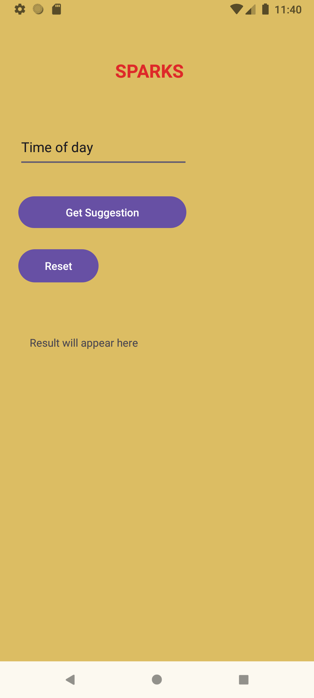
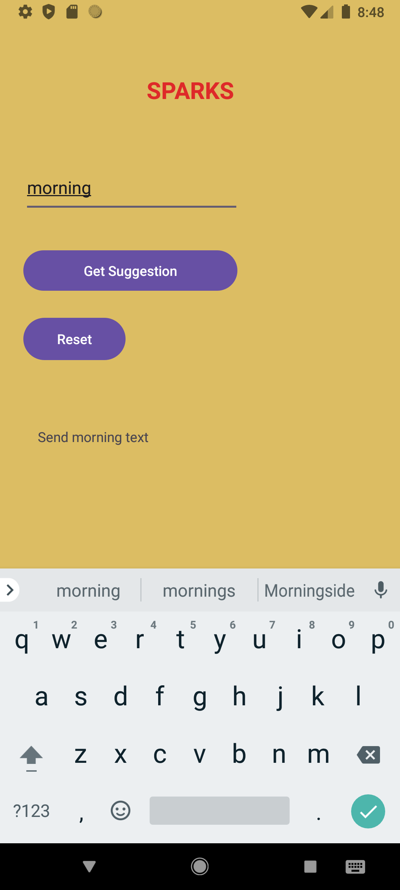
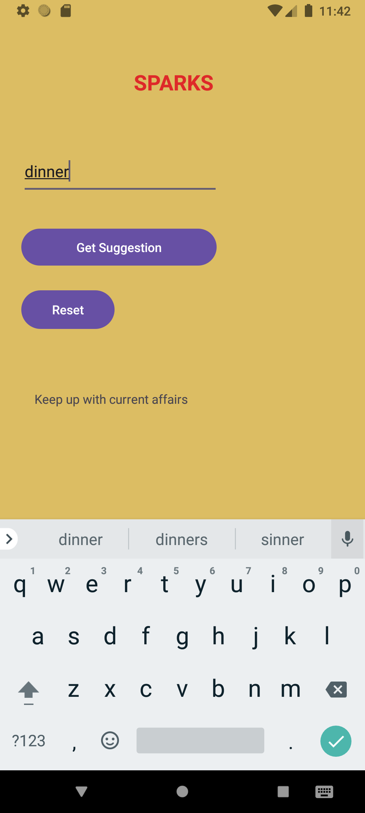

# Sparks App 
This app is a simple app that provides social interaction based on the time of day. The purpose is to encourage users to engage and  thrcommuncation with othersoughout the day

# Features
Displays different messages depending on the time of day
Button to "Show Suggested" results
Button to reset input

# How the app works 
Enter the time of day (" morning, mid-morning, lunch, afternoon, dinner ")
User will then click "Show Suggestion"
App will show a suggestion based on the time of day inputed 
A relevant message will appear
Reset button will reset everything

# Video demonstration
[Click here to watch video](https://drive.google.com/file/d/1AWQsl-VCtYJal9Gj0DXkDPRafGkm3OM6/view?usp=drive_link)

# Screenshots

# Resources used
Android Studio
Kotlin
Github

# Code explanation
The app uses else statemants to check the time input and return a corresponding respnse
For examaple : Morning will correspond with a morning message, afternoon will correspond with a interaction message and lunch will correspond with a check-in message 
 
# References
Andriod Developers. Avaialble at: <https://android.com>  [Accessed 30 March 2026]
Kotlin. Available at: <https://home.kotlinlang.org/docs/home.html> [Accessed 30 March 2026]
